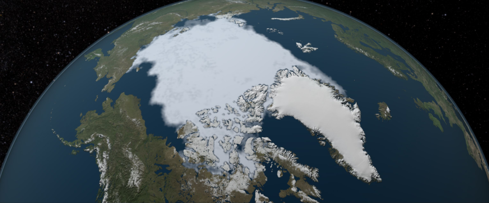
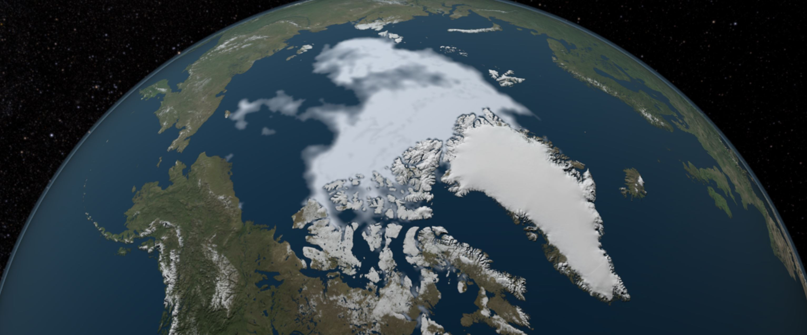

##
##
##
#### **The Earth is warming up.** 

According to the National Oceanic and Atmospheric (NOAA), the planet's average surface temperature has risen about 1.62 degrees Fahrenheit since the late 19th century, and the five warmest years on record have all been within the past 9 years. There is substantial evidence that carbon dioxide (CO~2~) warms the planet, and the amount in the air has increased by nearly half, with the sharpest increase beginning in the 1960's. 

CO~2~ is a harmful gas that pollutes the air we breathe. Burning fossil fuels are a main contributor to CO~2~ being emitted to the atmosphere. Fossil fuels are non-renewable energy resources such as coal, oil and natural gas. CO~2~ and other greenhouse gases warm the planet by absorbing the sun's energy and preventing heat from escaping back into space.

**Ninety-seven percent of climate scientists agree that the rise in CO~2~ levels and temperature is due to human activity!**

The Earth has historically gone through phases of temperature change. However, it is the **current rate at which the Earth is warming that is alarming.** In the United States, power plants create the most human-caused greenhouse gas emissions, followed by all forms of transportation. Currently, 40 billion tons of CO~2~ from burning fossil fuels from around the world are being added to the atmosphere every year. Forests only soak up about 30% of all human CO~2~ emissions, while most CO~2~ builds up in the atmosphere, trapping heat for hundreds of years. 

Rise in temperature
>

Nearly 5 million deaths each year are attributed to air pollution, a mixture of smoke and harmful gases like carbon dioxide that enter the air. Air pollution is a huge risk factor and can cause or worsen medical problems such as heart disease, stroke, respiratory infections, lung cancer, and diabetes.

Global warming is increasing the likelihood of extreme weather. Warmer temperatures mean an increase in water evaporation from the ground which leads to droughts. The abundance of water goes into the atmosphere and later causes severe rainfall. The ocean temperatures are also warming up which greatly affects the frequency and intensity of hurricanes.

View of Hurricanes from Space. Photo Courtesy of NASA.
>

The NOAA states that sea levels rise about one-eighth of an inch every year. This is because water expands with rising temperatures and the ice caps are melting at a rapid pace, as seen in the photos below. Rising sea levels cause coastal storms to go farther inland and severe flooding. Flooding is already the most destructive natural disaster in the United States.

Ice Cap 1984. Photo Courtesy of NASA.
>

Ice Cap 2012. Photo Courtesy of NASA.
>

Are humans really to blame?

According to the data, human activity is highly correlated to global warming concerns.

I gathered data from several sources and ran a statistical analysis to see if human factors could predict a rise in CO2 levels, land and ocean temperatures, or changes in sea ice spatial extent. The human factors used in the analysis were using oil for energy (1979-2017), using coal for energy (1979-2017), and the number of cars manufactured per year (1999-2019).

Every model created proved to be statistically significant. In other words, there is a substantial relationship between the human factors (oil use, coal use, and production of cars) and signs of global warming. All three factors predicted a decrease in sea ice extent, an increase in CO2 levels, and an increase in land and ocean temperatures.

Overall, 10 out of the 12 models created were able to explain over 70% of the variation in the global warming concerns. The use of oil appeared to be the greatest contributor. In the most significant model, oil explained about 97% of the variation in ocean temperatures. The production of cars was still a significant predictor but not as much so as oil and coal. Even in the worst model, the production of cars explained about 57% of the variation in sea ice extent. 

Data was gathered from the NOAA, NASA, [OICA](http://www.oica.net/), and [Global Energy Monitor](https://globalenergymonitor.org/coal/global-coal-plant-tracker/). 
