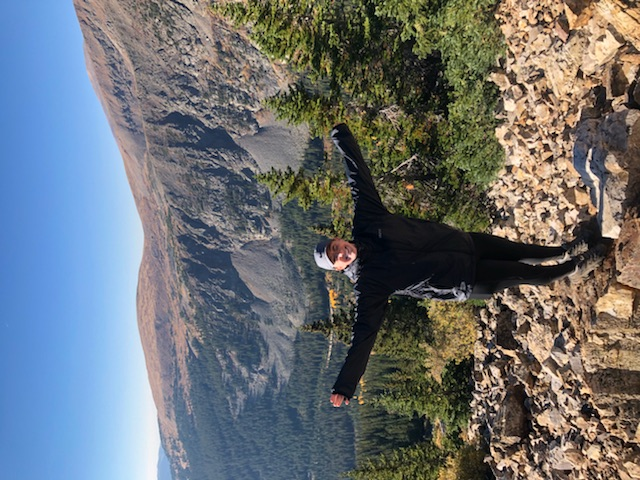

  
Hi! My name is Lauren. I am a senior honors student at Kennesaw State University majoring in Computational and Applied Mathematics with a minor in Applied Data Analysis. I am set to graduate with honors in December 2019.

During my time at Kennesaw State University, I participated in R Day 2018 and Analytics Day 2019, and will be participating in R Day 2019. I was awarded 1st place in R Day 2018 for my project, "Increasing the Top Line by Thousands," where I utilized proactive outreach and marketing strategies to increase revenue by $11,496 annually at my current place of employment, Life Time.
You can view my full project on my LinkedIn (link to linkedin above next to email). 

Currently, I am an Aquatics Assistant Manager at Life Time. As the assistant manager, I oversee 40+ team members, manage financials, and deliver exceptional customer service. During my time in this position, I assisted in the rebuild of the Life Time Aquatics Swim program at my club. As a revenue driven department, we prioritize customer experience. With my 5+ years of professional customer experience I have been able to provide the best service and have become the go-to person to handle member situations. Since the initial rebuild, my team has had great success as we have exceeded in all of our financial goals and we have one of the best Aquatics departments in the region! 

I have intermediate experience in Mark-Up languages HTML and CSS, and programming languages Java and C#. I also have experience working with the hosting service, GitHub. I have advanced experience in programming languages R, Python, and SAS. 